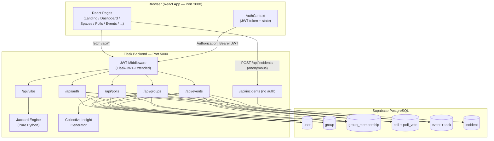
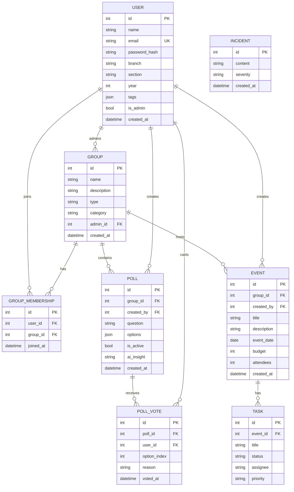
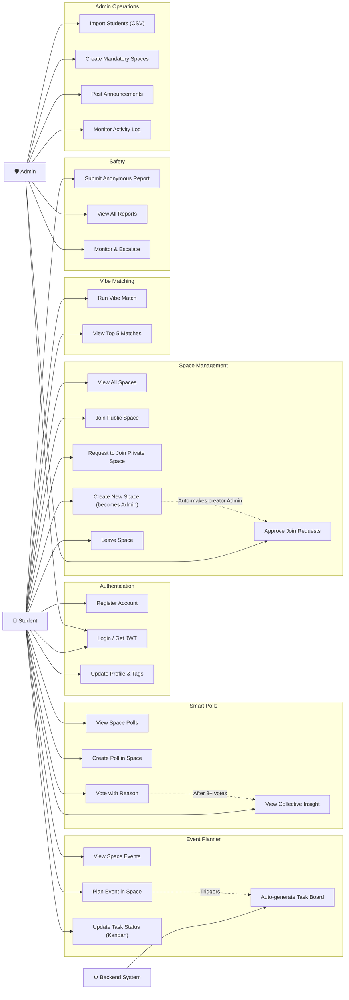
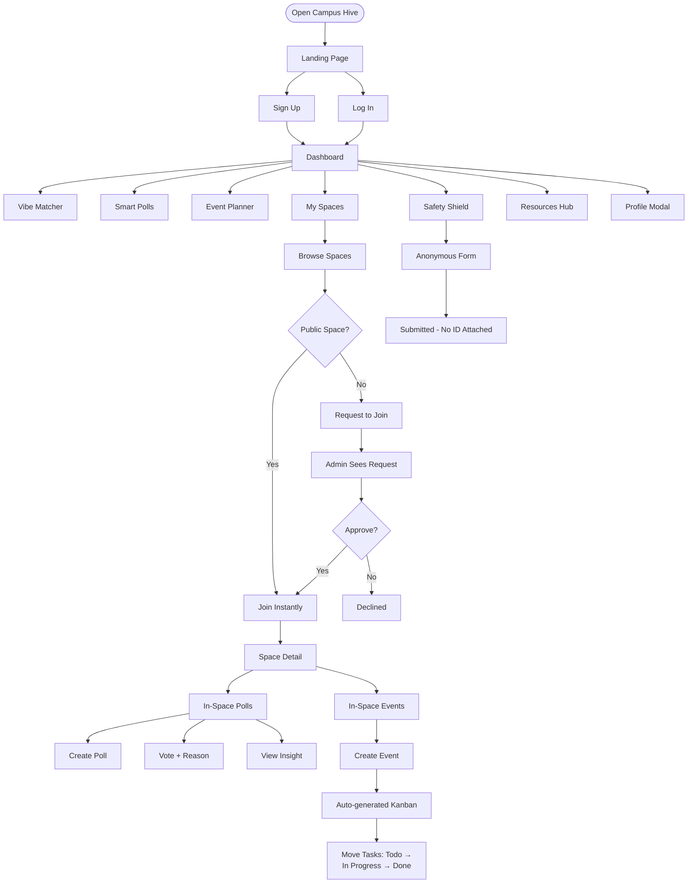

# 🐝 Campus Hive — Complete Project Guide

> **Reviewer's Reference** · This document covers the project overview, tech stack, architecture, UML diagrams, actor interactions, and file map.

---

## 1 · What is Campus Hive?

**Campus Hive** is a **unified student collaboration platform** for ANITS (Anil Neerukonda  Institute of Technology and Science). It replaces fragmented WhatsApp groups, notice boards, and spreadsheets with a single, intelligent platform that covers:

| Problem Solved | Feature |
|----------------|---------|
| "Who shares my interests?" | **Vibe Matcher** — Jaccard similarity matching |
| "What does the class want?" | **Smart Polls** — Reasoned voting with collective insights |
| "How do we plan this event?" | **Event Planner** — Auto-Kanban task board generation |
| "Where do clubs organize?" | **Spaces** — Public/Private/Mandatory spaces with polls & events |
| "How do I report harassment safely?" | **Safety Shield** — Anonymous, no-auth incident reporting |
| "Where are placement resources?" | **Resources Hub** — Interview experiences, study material, announcements |
| "Who runs the platform?" | **Admin Panel** — Student import, space management, monitoring |

---

## 2 · Tech Stack

### Backend

| Layer | Technology |
|-------|-----------|
| Framework | **Flask 3.0** (Python) |
| Database | **Supabase PostgreSQL** (hosted) |
| ORM | **SQLAlchemy 2.0** + Flask-SQLAlchemy |
| Authentication | **Flask-JWT-Extended** (HS256 JWT, 24h expiry) |
| Password Hashing | **Flask-Bcrypt** (bcrypt, cost factor 12) |
| CORS | Flask-CORS |
| Environment | python-dotenv |
| Server | Gunicorn (production), Flask dev server (dev) |
| Smart Features | Custom Jaccard similarity engine (pure Python) |

### Frontend

| Layer | Technology |
|-------|-----------|
| Framework | **React 18** + **TypeScript** |
| Build Tool | **Vite 5** |
| Routing | React Router DOM v6 |
| Styling | **Tailwind CSS 3** + custom glassmorphism |
| Animations | **Framer Motion** |
| Icons | Lucide React |
| State | React Context API + useState |
| Fonts | Inter (Google Fonts) |

### Infrastructure

| Service | Purpose |
|---------|---------|
| **Supabase** | PostgreSQL database hosting + real-time capability |
| **GitHub** | Version control |
| **Vite Proxy** | `/api/*` proxied to Flask on port 5000 |

---

## 3 · System Architecture



---

## 4 · Database Entity-Relationship Diagram



---

## 5 · Use Case Diagram — Actor Interactions



---

## 6 · User Flow Diagram



---

## 7 · API Endpoint Reference

### Authentication
| Method | Route | Auth | Description |
|--------|-------|------|-------------|
| POST | `/api/auth/signup` | None | Create student account |
| POST | `/api/auth/login` | None | Login → JWT token |
| GET | `/api/auth/me` | JWT | Get current user |
| PUT | `/api/auth/me` | JWT | Update profile |

### Groups (Spaces)
| Method | Route | Auth | Description |
|--------|-------|------|-------------|
| GET | `/api/groups/` | JWT | List all groups |
| POST | `/api/groups/` | JWT | Create new group |
| GET | `/api/groups/<id>` | JWT | Get group details |
| PUT | `/api/groups/<id>` | JWT Admin | Update group |
| DELETE | `/api/groups/<id>` | JWT Admin | Delete group |
| POST | `/api/groups/<id>/join` | JWT | Join / request to join |

### Polls
| Method | Route | Auth | Description |
|--------|-------|------|-------------|
| GET | `/api/polls/` | JWT | List polls |
| POST | `/api/polls/` | JWT | Create poll |
| GET | `/api/polls/<id>` | JWT | Get poll details |
| POST | `/api/polls/<id>/vote` | JWT | Vote with reason |
| GET | `/api/polls/<id>/insight` | JWT | Get collective insight |

### Events
| Method | Route | Auth | Description |
|--------|-------|------|-------------|
| GET | `/api/events/` | JWT | List events |
| POST | `/api/events/` | JWT | Create event |
| GET | `/api/events/<id>` | JWT | Get event + tasks |
| PUT | `/api/events/<id>/tasks/<task_id>` | JWT | Update task status |

### Vibe Matching
| Method | Route | Auth | Description |
|--------|-------|------|-------------|
| GET | `/api/vibe/matches` | JWT | Get top-5 vibe matches |

### Safety Reports
| Method | Route | Auth | Description |
|--------|-------|------|-------------|
| POST | `/api/incidents/` | **None** | Anonymous report |
| GET | `/api/incidents/` | JWT Admin | List all reports |

### Health
| Method | Route | Auth | Description |
|--------|-------|------|-------------|
| GET | `/health` | None | Server health check |

---

## 8 · Project File Map

```
vibe project/
│
├── setup_backend.bat        ← Run this FIRST (install Python deps)
├── setup_frontend.bat       ← Run this SECOND (install npm packages)
├── start_all.bat            ← Start both servers
├── test_api.bat             ← Test all 12 API endpoints
│
└── campus-hive/
    ├── SUPABASE_GUIDE.md    ← How to view/manage database
    ├── AUTH_GUIDE.md        ← JWT authentication reference
    ├── PROJECT_GUIDE.md     ← This file (architecture + UML)
    │
    ├── backend/             ← Flask REST API
    │   ├── .env             ← Supabase + JWT + Gemini credentials
    │   ├── requirements.txt
    │   ├── run.py           ← Entry point
    │   ├── app/
    │   │   ├── __init__.py  ← create_app() factory
    │   │   ├── models/      ← SQLAlchemy models (User, Group, Poll, Event, Task, Incident)
    │   │   ├── routes/      ← Blueprints (auth, groups, polls, events, vibe, incidents)
    │   │   └── utils/       ← Jaccard engine, AI insights helper
    │   └── venv/            ← Python virtual environment
    │
    └── frontend/            ← React + Vite + TypeScript
        ├── package.json
        ├── vite.config.ts   ← Proxy /api/* → port 5000
        ├── tailwind.config.js
        └── src/
            ├── App.tsx      ← AuthContext + all state + routing
            ├── main.tsx
            ├── index.css    ← Glassmorphism + Tailwind
            └── pages/
                ├── Landing.tsx
                ├── Login.tsx / Signup.tsx
                ├── Dashboard.tsx    ← Sidebar + profile modal
                ├── Spaces.tsx       ← Join/Request/Admin flow
                ├── SmartPolls.tsx   ← Space-scoped polls
                ├── EventPlanner.tsx ← Kanban events
                ├── VibeMatcher.tsx
                ├── Safety.tsx
                ├── Resources.tsx
                ├── AdminLogin.tsx
                └── AdminPanel.tsx   ← 5-tab admin dashboard
```

---

## 9 · Running the Project — Quickstart

```
1. Double-click  setup_backend.bat   (first time only)
2. Double-click  setup_frontend.bat  (first time only)
3. Double-click  start_all.bat       (every time you want to run)
4. Open          http://localhost:3000
```

To test all API endpoints:
```
5. Double-click  test_api.bat
```

---

## 10 · Environment Requirements

| Software | Minimum Version | Check Command |
|----------|-----------------|---------------|
| Python | 3.10+ | `python --version` |
| Node.js | 18+ | `node --version` |
| npm | 9+ | `npm --version` |
| curl | *(ships with Windows 10+)* | `curl --version` |

> **Internet required** on first run to connect to Supabase and download npm packages.
